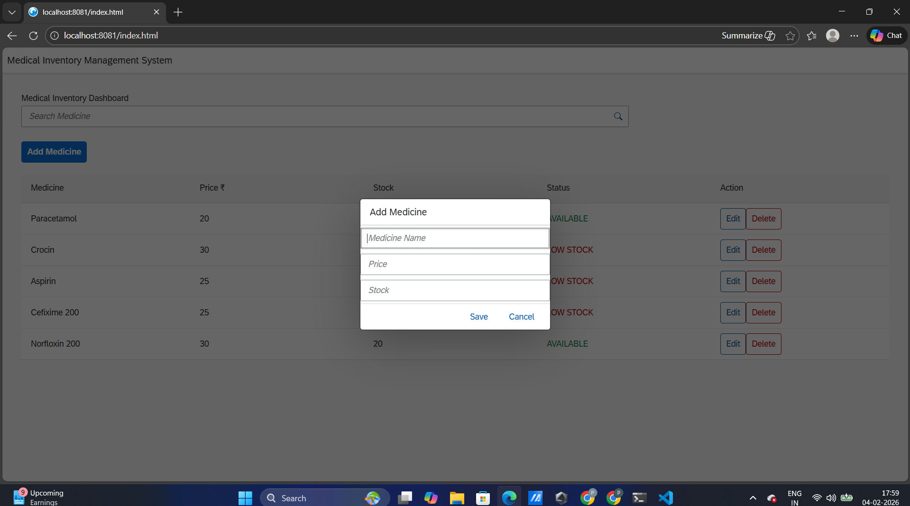
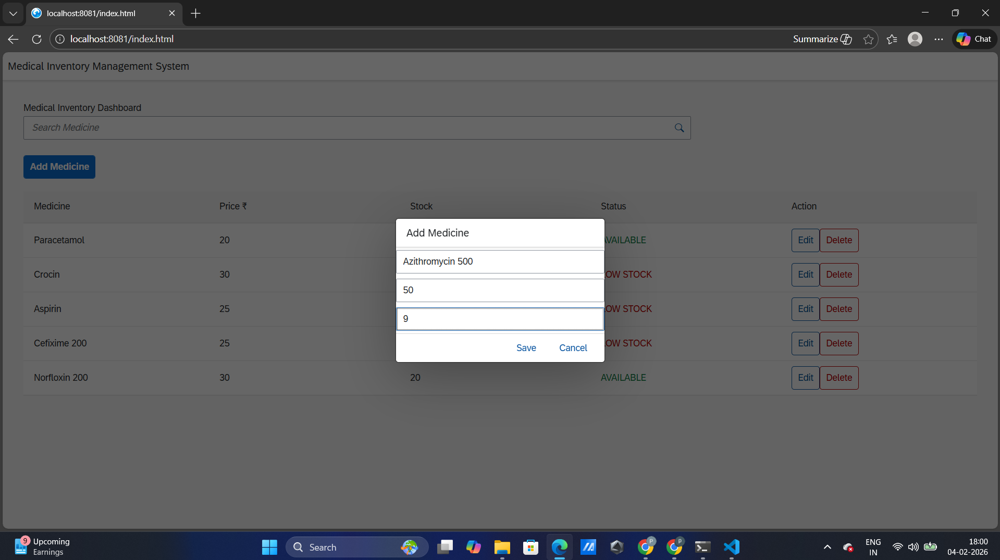
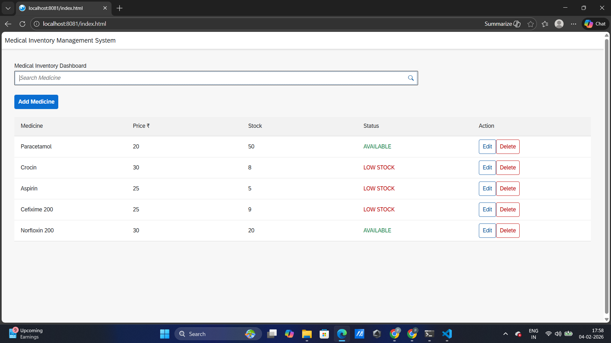

# 🏥 Medical Inventory Management – SAP Fiori App

## 📌 Overview
This is an enterprise-style Medical Inventory Management application built using **SAP UI5 (Fiori)**.  
The system helps manage medicines, track stock levels, and perform CRUD operations efficiently.

---

## 🚀 Features
✅ Add, Edit, Delete Medicines  
✅ Live Search Functionality  
✅ Stock Status Indicator (Available / Low Stock)  
✅ Responsive SAP Fiori Design  
✅ Popup Dialog for Medicine Entry  

---

## 🛠️ Technologies Used
- SAP UI5
- JavaScript
- HTML/CSS
- MVC Architecture

---

## 📸 Application Preview

### 🔹 Dashboard


### 🔹 Add Medicine Popup


### 🔹 Inventory Table


---

## ▶️ How to Run the Project
```bash
npm install
npm start
